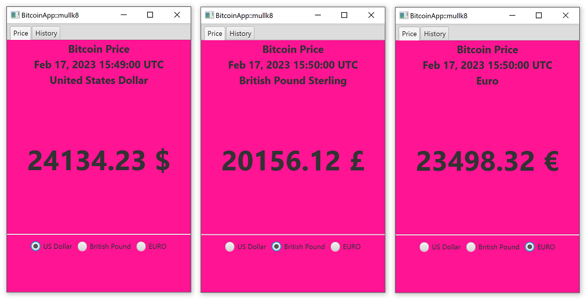
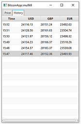

#  Bern University of Applied Sciences
#### BTI2015-20/21 Kotlin for Java Developers
#### Student: Mac Müller
#### Advisor: Prof. Dr. Annett Laube

Application with Kotlin:
1. the app connects with API to fetch the current prices of bitcoin.
2. Scheduling call to update the prices every minute.
3. GUI: Shows the prices and price-history.

